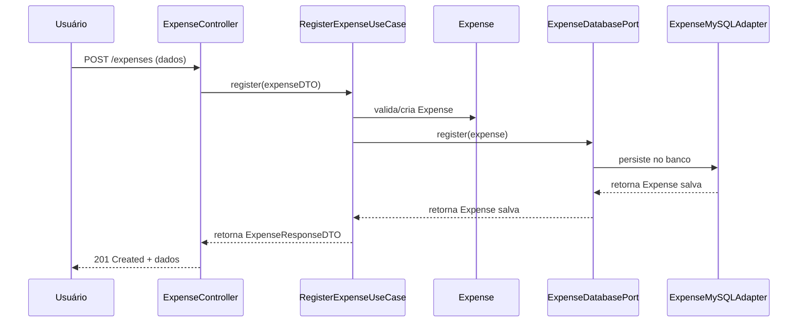
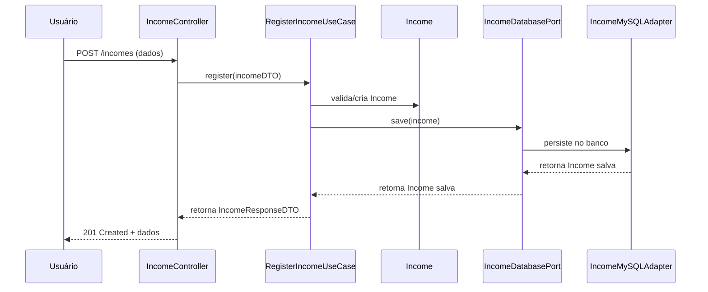
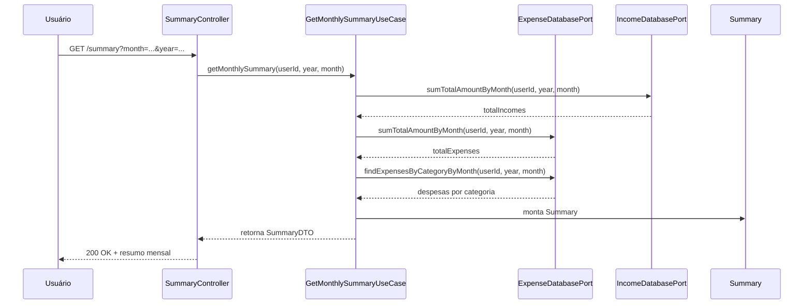
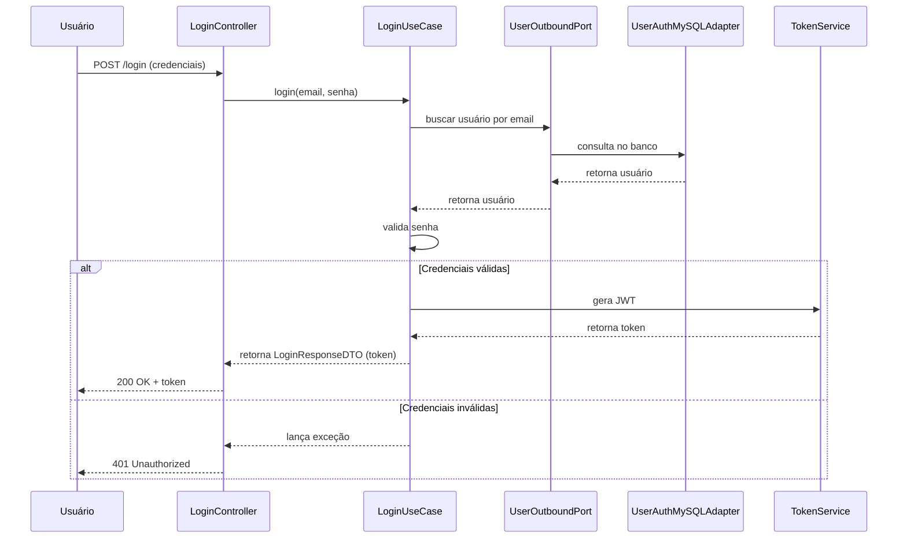

# Budget App

Aplicação de controle de orçamento pessoal, permitindo o registro de receitas e despesas mensais, além de fornecer um balanço financeiro do usuário.

### Tecnologias usadas

- Java 17
- Spring Boot
- Maven
- MySQL
- Docker
- JUnit (testes)
- Swagger/OpenAPI

### Arquitetura usada no projeto

Esse projeto foi projetado usando a arquitetura Hexagonal (Ports & Adapters), visando facilitar a extensão e manutenção do projeto a longo prazo. O domínio é isolado de frameworks e detalhes técnicos, promovendo testabilidade e evolução.

### Funcionalidades

- Cadastro, atualização e remoção de receitas e despesas
- Consulta de lançamentos por mês e descrição
- Resumo mensal (balanço de receitas, despesas e saldo)
- Autenticação de usuários
- API documentada via Swagger

### Como subir o projeto localmente

#### Variáveis de Ambiente

Algumas variáveis podem ser configuradas via `application.yml` ou diretamente no ambiente:

- `JWT_SECRET`: Chave secreta para geração dos tokens JWT.
- `DB_HOST`: Host do banco de dados (padrão: `localhost`).
- `DB_PORT`: Porta do banco de dados (padrão: `3306`).
- `DB_USER`: Usuário do banco de dados (padrão: `root`).
- `DB_PASSWORD`: Senha do banco de dados (padrão: `root`).

Exemplo de uso no Linux/Mac:
```bash
export JWT_SECRET=minha-chave-secreta
export DB_PASSWORD=suasenha
```
```

1. Suba o banco de dados com Docker Compose:
   ```bash
   docker-compose up -d
   ```
2. Rode a aplicação pela IDE executando a classe `BudgetApplication.java` ou via terminal:
   ```bash
   ./mvnw spring-boot:run
   ```

### Configuração

- As configurações de banco, JWT e outros parâmetros estão em `src/main/resources/application.yml`.
- Para ambiente local, use o perfil padrão.
- Para produção, configure as variáveis de ambiente conforme necessário.

### Testes

- Testes unitários e integrados estão em `src/test/java/`.
- Para rodar todos os testes:
  ```bash
  ./mvnw test
  ```

### API (Swagger)

- A documentação interativa da API está disponível em:
  http://localhost:8080/swagger-ui.html

### Estrutura de Pastas

```
src/
  main/
    java/
      br/com/janadev/budget/
        domain/         # Entidades, regras de negócio, ports
        inbound/        # Controllers, DTOs
        outbound/       # Adapters, repositórios, configs
  test/
    java/
      br/com/janadev/budget/
        unit/           # Testes unitários
        integrated/     # Testes integrados
```

### Diagramas de Sequência das Funcionalidades Principais

#### Registrar Despesa



#### Registrar Receita



#### Resumo Mensal



#### Autenticação (Login)


### Como Contribuir

1. Faça um fork do projeto
2. Crie uma branch para sua feature (`git checkout -b minha-feature`)
3. Commit suas alterações (`git commit -m 'feat: minha nova feature'`)
4. Faça push para a branch (`git push origin minha-feature`)
5. Abra um Pull Request

Siga o padrão de commits [Conventional Commits](https://www.conventionalcommits.org/pt-br/v1.0.0/).

### Responsáveis

- [Janaina Paula](https://github.com/JanainaPaula)
